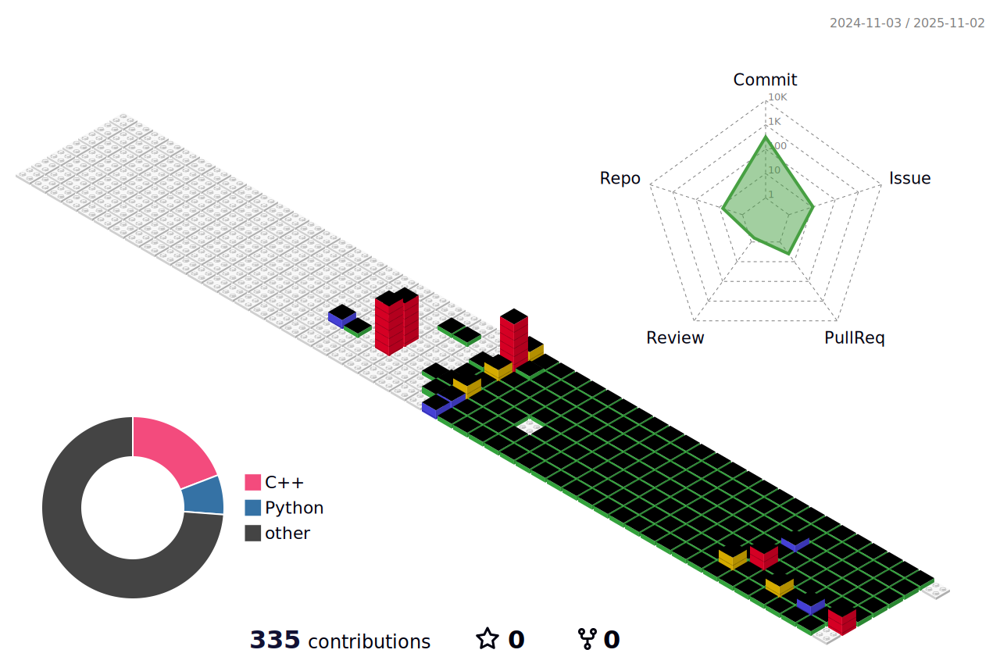

 
  <h2 style="border-bottom: 1px solid #21262d; color: #c9d1d9;"></h2>  
  

 

## 🛠 Tech Stack  
Techs that I've used at least once  

<!-- Tech stack badges -->

  
  
  
  
  
   
  
  
  
  

---

## 📊 Stats

<!-- GitHub Stats & Most Used Languages -->

  
  
  

<!-- 3D Block + Tier card 나란히 -->

  
  

